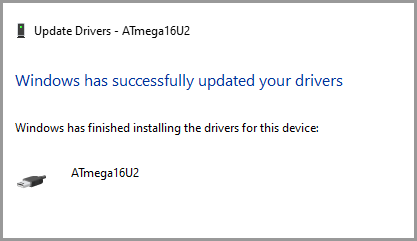

# Basic information

 | Component | Description |
 | ---       | ---         |
 | Processor | ATMega16U2  |
 |LED|24x7 matrix|


# Clone the Ravello Repository

Find it at [https://github.com/komar007/ravello_firmware](https://github.com/komar007/ravello_firmware)


Download AtMel Flip [https://www.microchip.com/DevelopmentTools/ProductDetails/PartNO/FLIP](https://www.microchip.com/DevelopmentTools/ProductDetails/PartNO/FLIP)

# Download the C Compiler

[https://blog.zakkemble.net/avr-gcc-builds/](https://blog.zakkemble.net/avr-gcc-builds/)


# Run Make

`cd C:\Dropbox\Projects\Personal\TechKeys\src\ravello_firmware`


`c:\code\portable\Winavr\bin\make.exe`


I got that error on line 74, so I checked and with some search I found this:
http://fab.cba.mit.edu/classes/863.14/people/andrew_mao/week11/

Apparently "clock_div_1" is not defined in avr/power.h for Atmega16u2, so for make to work, and still disable the clock prescaler you need to comment line 74 and add this code:

CLKPR = (1 << CLKPCE);
CLKPR = (0 << CLKPS3) | (0 << CLKPS2) | (0 << CLKPS1) | (0 << CLKPS0);

That works!

Thx for hiduino guys!

## Check **/bin** folder:

  | Output File                | Purpose |
 | ---                        | ---     |
 | ukbdc_techkeys2-0.1.elf    |
 | ukbdc_techkeys2-0.1.hex    |
 | ukbdc_techkeys2-0.1_ee.hex |


Source Code

**Line 60-65**
```c
uint8_t EEMEM ee_strings[4][MACRO_MAX_LEN+1] = {
	"Hello, World!",
	"\x05lhttp://techkeys.us\x0c",
	"\x05lhttp://fb.com/techkeysus\x0c",
	"\x05lmailto:info@techkeys.us\x0c"
};
```


# Install the Device in Windows


## Short the pins on the device

1. Go to **Device Manager**
2. Right click **Unknown Device**
3. Choose **Browse**
4. Choose `c:\program files (x86)\atmel\Flip 3.4.7\usb`


AtMega16U2

If this works you should see "Windows Has Successfully updated your drivers"





# Projects

## Change the bitmap logo that scrolls in the screen

### Run the existing bash script (in Windows)


#### Get a linux distribution to do it for me

Why not [enable Bash in Windows 10](https://itsfoss.com/install-bash-on-windows/) while I'm at it?

1. Enable the Windows Subsystem for Linux (WSL) 

`Enable-WindowsOptionalFeature -Online -FeatureName Microsoft-Windows-Subsystem-Linux`

2. Make sure it works

```c
 Get-WindowsOptionalFeature -Online -FeatureName Microsoft-Windows-Subsystem-Linux
 ```

Check that output:

```c
FeatureName      : Microsoft-Windows-Subsystem-Linux
DisplayName      : Windows Subsystem for Linux
Description      : Provides services and environments for running native user-mode Linux shells and tools on Windows.
RestartRequired  : Possible
State            : Enabled
CustomProperties :
                   ServerComponent\Description : Provides services and environments for running native user-mode Linux shells and tools on Windows.
                   ServerComponent\DisplayName : Windows Subsystem for Linux
                   ServerComponent\Id : 1033
                   ServerComponent\Type : Feature
                   ServerComponent\UniqueName : Microsoft-Windows-Subsystem-Linux
                   ServerComponent\Deploys\Update\Name : Microsoft-Windows-Subsystem-Linux
```

2. Pick a distribution? Open **The Microsoft Store**

I picked **Ubuntu**

Now **run** it.
Turn off that beep.
[Change the Dark Blue](https://superuser.com/questions/1365258/how-to-change-the-dark-blue-in-wsl-to-something-brighter)

Install ImageMagick:

```sudo apt-get update```

```sudo apt-get install imagemagick```

Make sure line endings work
```sudo apt-get install dos2unix```

dos2unix 


Enable-WindowsOptionalFeature -Online -FeatureName Microsoft-Windows-Subsystem-Linux

